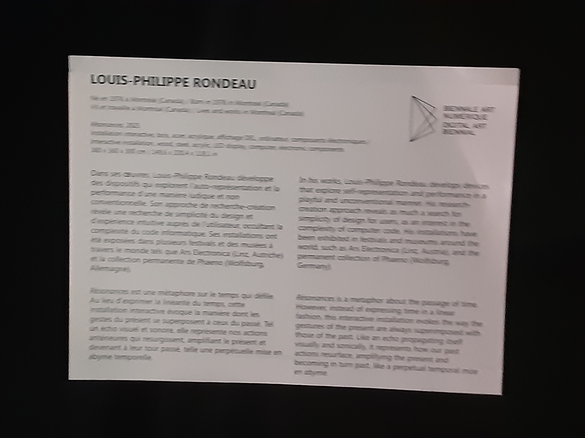
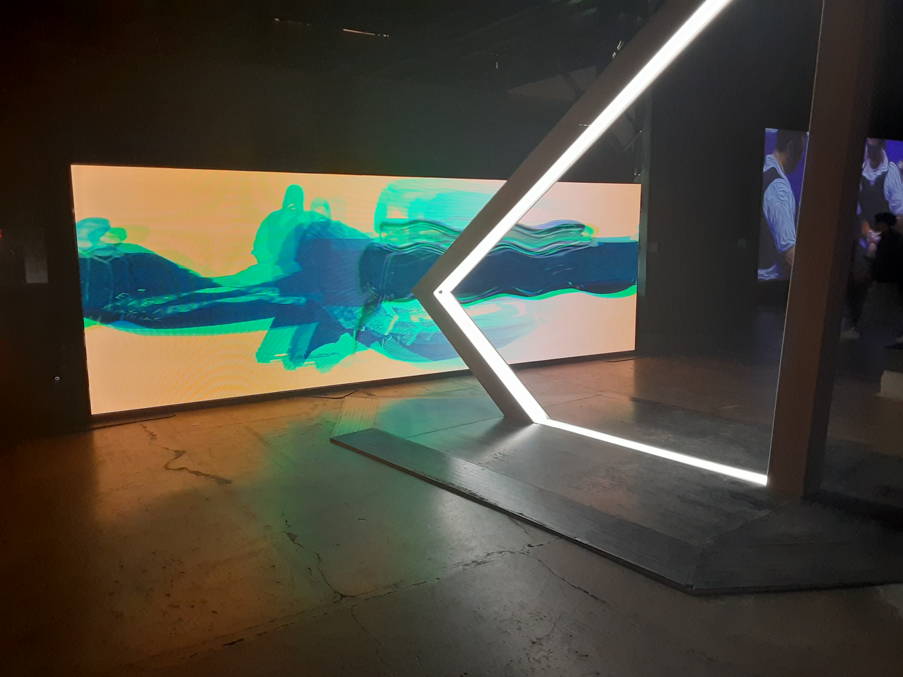
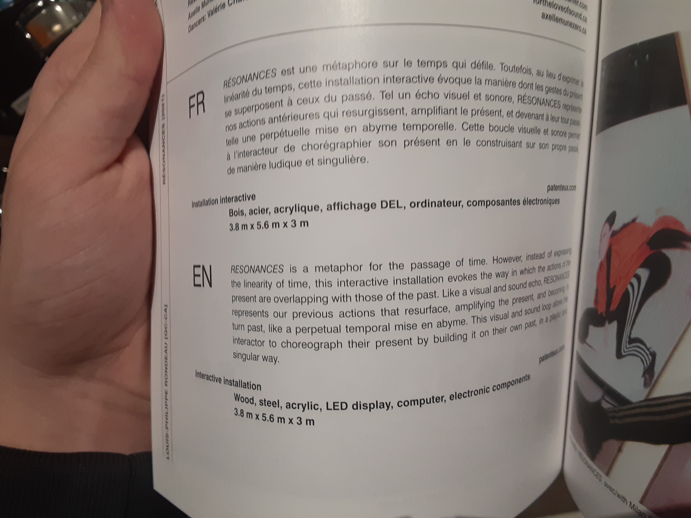
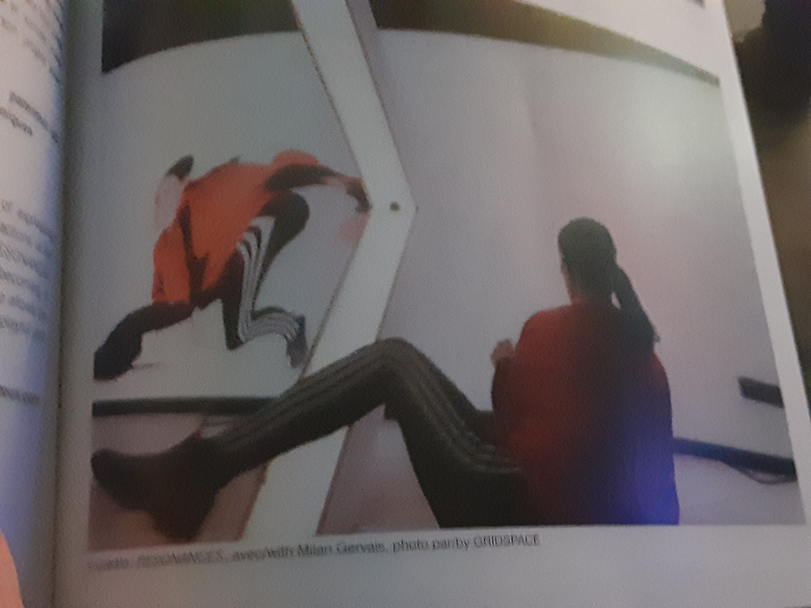
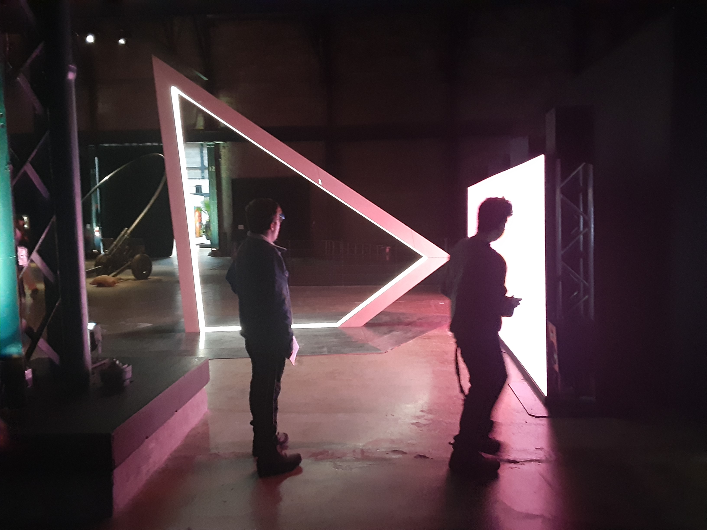
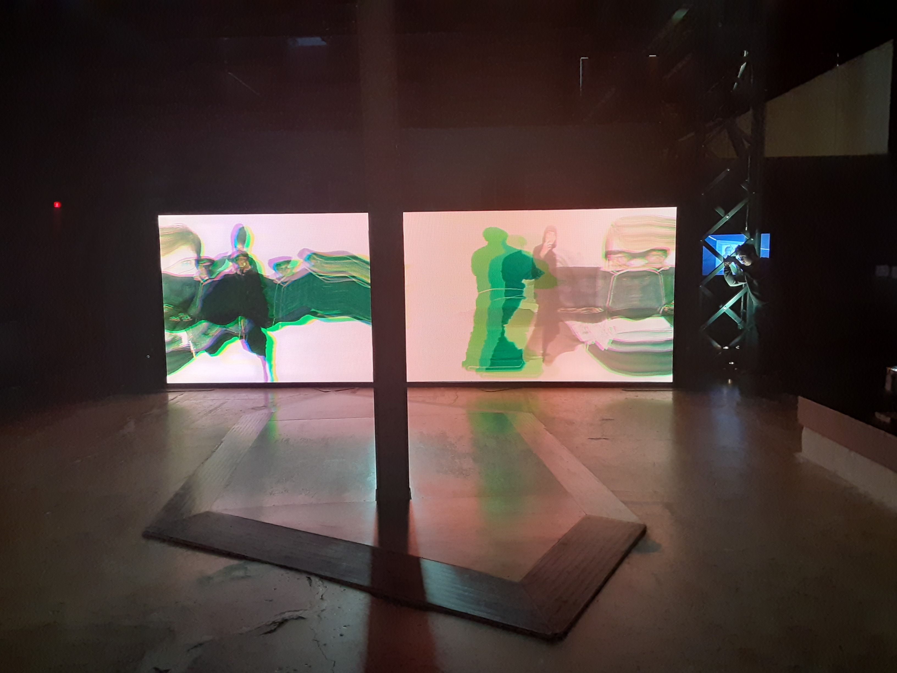
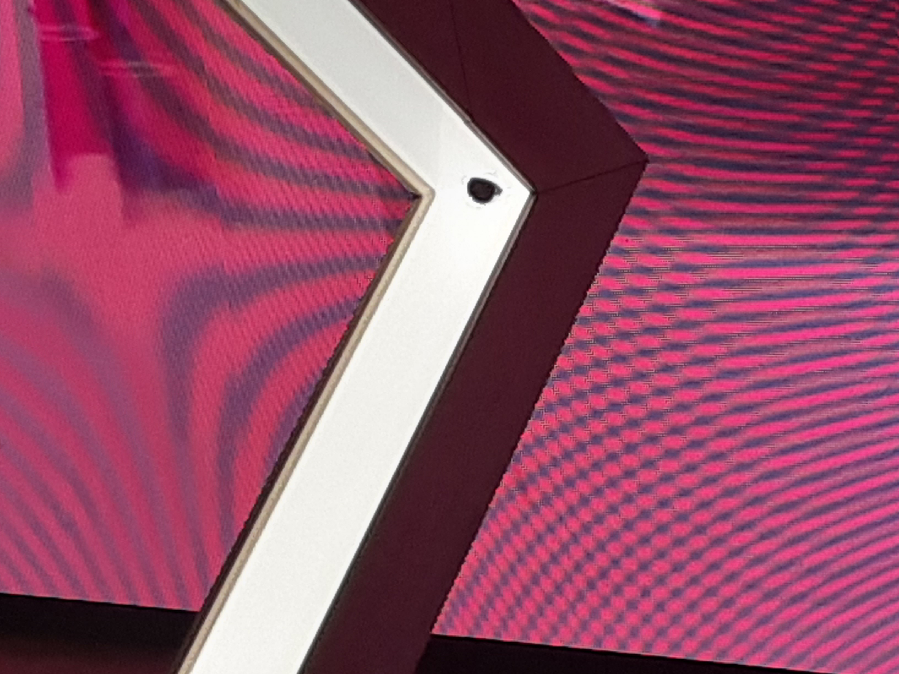
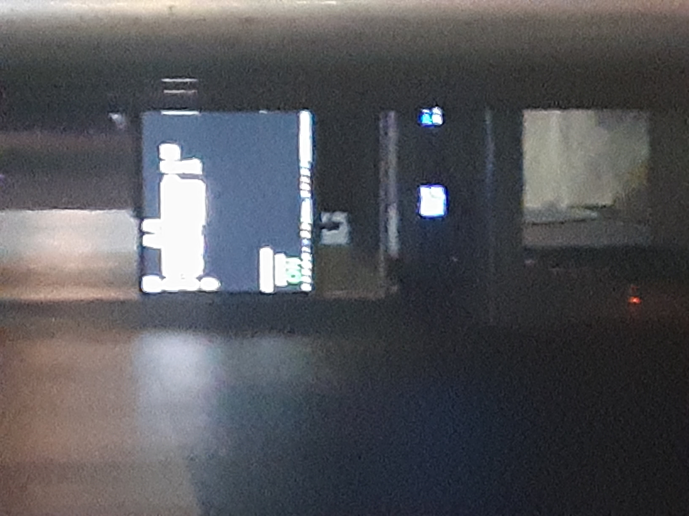

# BIAN
**Nom de l'exposition:**
Mutation BIAN 6

**Lieu de mise en exposition**

**Type d'exposition:**
Intérieure

**Date de votre visite:**
3 Février 2023 - 03/02/2023 

**titre de l'oeuvre:**
RÉSONANCES

**Nom de l'artiste:**
Louis-Philippe Rondeau

**Année de réalisation:**
2021

**Description de l'oeuvre:**

**Type d'installation: Interactive**

**Mise en espace:**

**Composantes et techniques:**

**Éléments nécessaires à la mise en exposition:**

caméra

écran,
ordinateur

**Expérience vécue:**
https://youtu.be/j8OxmzXTF3A

**Ce qui m'a plu, m'a donné des idées:**

**Aspect que vous ne souhaiteriez pas retenir pour vos propres créations ou que vous feriez autrement et justifications:**
